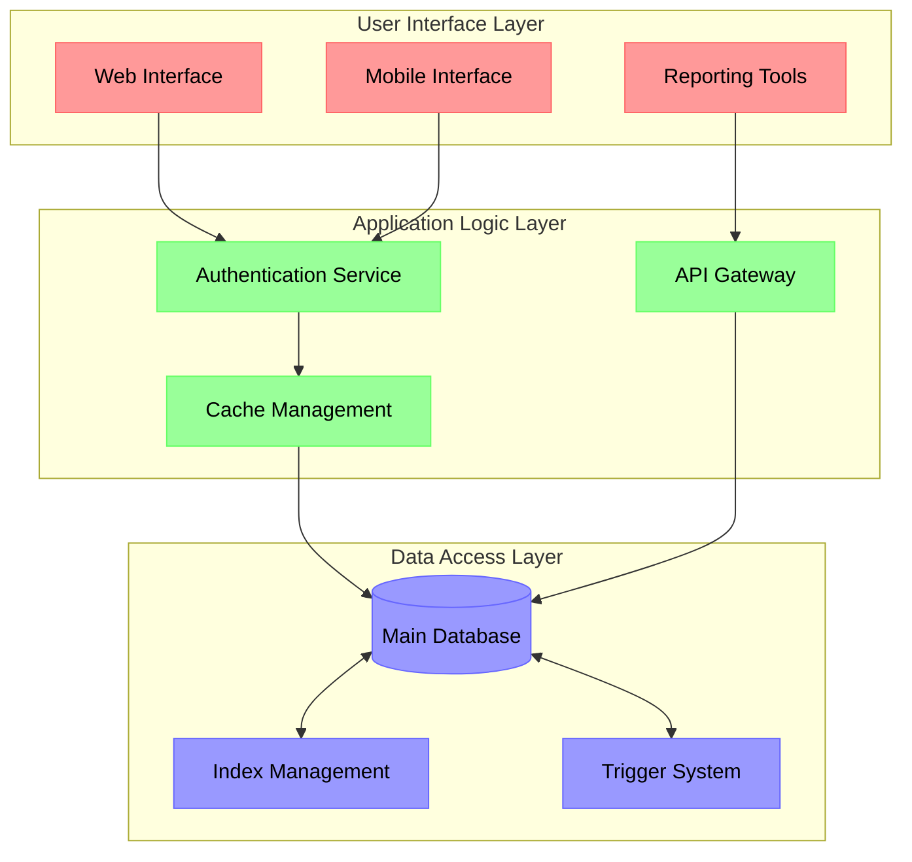

# MCG Energy Software Enhancement Technical Documentation

| Introduction |
| --- |
| System Architecture |
| Technical Stack |
| Implementation Details |
| Code Examples |
| Testing Strategy |
| Deployment Guidelines |
| Next Steps |
| Glossary |

## Introduction

This technical documentation outlines the enhancement strategy for MCG Energy's software solutions, focusing on advanced TSQL implementations, modular architecture, and collaborative development practices. The document provides comprehensive guidance for implementing optimized database operations, maintaining system integrity, and ensuring scalability.

## System Architecture

The proposed system architecture follows a layered approach, separating concerns while maintaining modularity and extensibility.



The architecture diagram illustrates the three-tier system design, where:

- Red components represent user-facing interfaces
- Green components show application logic and services
- Blue elements indicate data layer components
- Arrows represent data flow and dependencies between layers

## Technical Stack

### Core Technologies

- Database: MS SQL Server 2019+
- Backend: TSQL, Stored Procedures
- Frontend: Responsive UI Components
- Security: SSL/TLS Encryption
- Version Control: Git

### Development Tools

- IDE: SQL Server Management Studio
- Source Control: Azure DevOps
- Testing Framework: tSQLt
- Monitoring: SQL Server Profiler

## Implementation Details

### Database Optimization

```sql
CREATE PROCEDURE sp_PerformanceMetrics
AS
BEGIN
    SET NOCOUNT ON;
    
    -- Index Usage Statistics
    SELECT 
        OBJECT_NAME(i.object_id) AS TableName,
        i.name AS IndexName,
        user_seeks,
        user_scans,
        user_lookups
    FROM sys.indexes i
    INNER JOIN sys.dm_db_index_usage_stats s 
        ON i.object_id = s.object_id AND i.index_id = s.index_id
    WHERE database_id = DB_ID()
    ORDER BY user_seeks DESC;

    -- Query Performance Metrics
    WITH RecentQueries AS (
        SELECT TOP 100 
            qs.sql_handle,
            qs.execution_count,
            qs.total_logical_reads,
            qs.total_logical_writes,
            qs.total_cpu_time,
            qs.total_elapsed_time
        FROM sys.dm_exec_query_stats qs
        ORDER BY qs.total_logical_reads DESC
    )
    SELECT * FROM RecentQueries;
END
GO
```

### Data Integrity Layer

```sql
CREATE TRIGGER trg_ValidateBusinessRules
ON Customers
AFTER INSERT, UPDATE
AS
BEGIN
    SET NOCOUNT ON;
    
    IF EXISTS (
        SELECT 1 
        FROM inserted i
        WHERE i.Address IS NULL OR LEN(LTRIM(RTRIM(i.Email))) = 0
    )
    BEGIN
        RAISERROR('Invalid customer data: Address and Email are required.', 16, 1);
        ROLLBACK TRANSACTION;
    END
    
    -- Validate business rules
    IF EXISTS (
        SELECT 1 
        FROM inserted i
        WHERE i.CreditLimit > 1000000 
        AND NOT EXISTS (
            SELECT 1 
            FROM CustomerApprovals ca 
            WHERE ca.CustomerID = i.CustomerID 
            AND ca.ApprovalStatus = 'APPROVED'
        )
    )
    BEGIN
        RAISERROR('Credit limit exceeds approval threshold.', 16, 1);
        ROLLBACK TRANSACTION;
    END
END
GO
```

## Testing Strategy

### Unit Testing Approach

```sql
CREATE SCHEMA Test;
GO

EXEC tSQLt.NewTestClass 'Test';
GO

CREATE PROCEDURE Test.[test_CustomerValidation]
AS
BEGIN
    EXEC tSQLt.FakeTable 'dbo.Customers';
    
    DECLARE @ValidEmail nvarchar(100) = 'test@example.com';
    DECLARE @InvalidEmail nvarchar(100) = '';
    
    -- Test valid email
    EXEC tSQLt.ExpectNoException 
        '@ProcedureName = ''dbo.trg_ValidateBusinessRules'', 
         @Message = ''Valid email should pass''';
    
    INSERT INTO dbo.Customers (Email) VALUES (@ValidEmail);
    
    -- Test invalid email
    EXEC tSQLt.ExpectException 
        '@ProcedureName = ''dbo.trg_ValidateBusinessRules'', 
         @ExpectedMessagePattern = ''Invalid customer data%'',
         @Message = ''Invalid email should fail''';
    
    INSERT INTO dbo.Customers (Email) VALUES (@InvalidEmail);
END;
```

## Deployment Guidelines

Pre-deployment Checklist- Backup existing database
- Verify connection strings
- Test rollback procedures
- Document version changes

Deployment Steps```sql
-- Step 1: Create schema version table
CREATE TABLE SchemaVersions (
    VersionID int PRIMARY KEY IDENTITY(1,1),
    DeploymentDate datetime DEFAULT GETDATE(),
    ChangeDescription nvarchar(500)
);

-- Step 2: Deploy stored procedures
EXEC sp_DeployStoredProcedures;

-- Step 3: Update indexes
EXEC sp_UpdateIndexStructure;

-- Step 4: Validate deployment
EXEC sp_ValidateSystemState;
```

## Next Steps

1. Phase 1 Implementation (Weeks 1-4):
  - Deploy core database optimizations
  - Implement basic triggers and constraints
  - Establish monitoring framework


2. Phase 2 Enhancement (Weeks 5-8):
  - Develop advanced reporting features
  - Implement automated testing suite
  - Enhance security measures


3. Phase 3 Optimization (After Week 8):
  - Performance tuning based on metrics
  - Additional feature development
  - Documentation updates


## Glossary

- **ACID Compliance**: Atomicity, Consistency, Isolation, Durability principles for database transactions
- **Connection Pooling**: Technique for reusing database connections to improve performance
- **Deadlock**: Situation where two or more processes are blocked indefinitely
- **Index Fragmentation**: Physical or logical disorder in index pages affecting query performance
- **Normal Form**: Standardized way of organizing relational database tables to minimize data redundancy
- **Parameter Sniffing**: SQL Server's process of optimizing queries based on parameter values
- **Query Plan**: Execution strategy chosen by the database optimizer
- **Schema Lock**: Mechanism preventing concurrent modifications to database structure
- **Transaction Isolation Level**: Rules governing concurrent access to shared data
